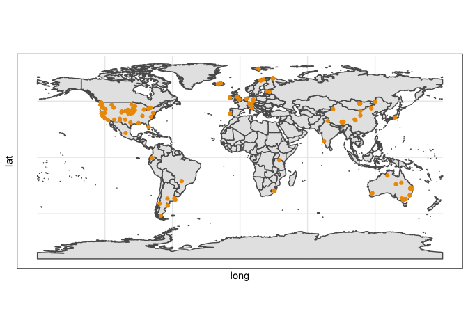
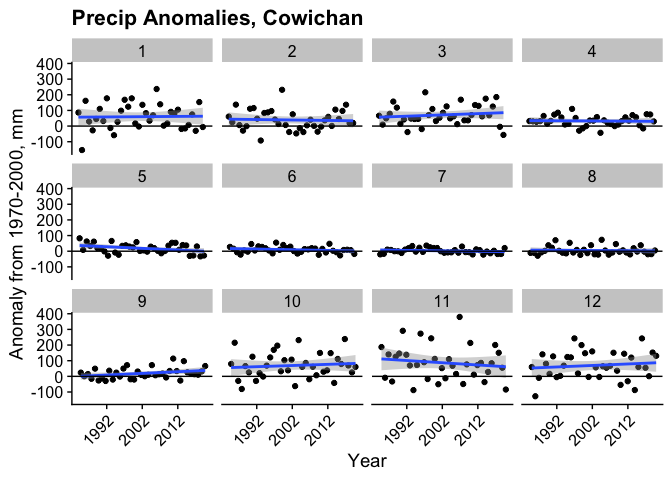
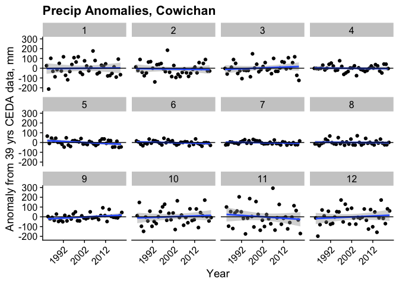
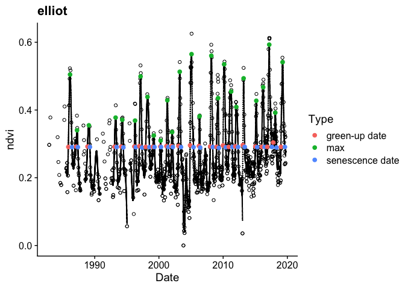

NutNet Phenology with NDVI
================
Ellen Esch
24 January 2021

# Overview

## This document walks through the steps necessary to:

  - 
Please change `process_raw_climate` equal to `TRUE` if you need to
download and process raw data. In most cases, this will likely remain as
`FALSE`, becuase intermediate (processed) files *are* stored on GitHub.

Likewise, change `process_raw_ndvi` equal to `TRUE` if you need to
process the landsat output.

You’ll need to read in the location of the sites being used in this
analysis. You’ll also need to store some files on your local machine, so
set a path to your desired
location.

``` r
sites <- read_csv("./data/NutNetGreening_2019.10.15_ee.csv", col_types = cols())
localdir <- "/Users/ellen/Desktop/Ellen/Guelph/Project_Andrew phenology/pheno_localdata"
dropboxdir <- "/Users/ellen/Dropbox/NutNet data"

process_raw_climate <- FALSE # TRUE

process_raw_ndvi <- FALSE # TRUE
```

And just for fun, here is a map of the sites in this analysis

<!-- -->

## Process weather & climate data

**Skip to step 5 if not needing to re-create data. Steps 1-4 walk
through raw data downloads.**

1)  Download montly [precipitation
    data](http://data.ceda.ac.uk/badc/cru/data/cru_ts/cru_ts_4.04/data/pre)
    onto your local machine (large files). You will have to either
    create an account or log in. Download 4 time periods (you want the
    files with the ‘nc’ in the name):

<!-- end list -->

  - 1981-1990
  - 1991-2000
  - 2001-2010
  - 2011-2019

<!-- end list -->

    ## [1] "not processing raw CLIMATE data"

2)  Repeat with montly [temperature
    data](http://data.ceda.ac.uk/badc/cru/data/cru_ts/cru_ts_4.04/data/tmp).

<!-- end list -->

    ## [1] "not processing raw CLIMATE data"

3)  Write a dataframe with merged monthly temperature and precipitation
    data

<!-- end list -->

    ## [1] "not processing raw CLIMATE data"

4)  **See point \#5**, but in general…. Download [30 year averages from
    WorldClim](https://www.worldclim.org/data/worldclim21.html) onto
    your local machine. Download the most detailed spatial level (30
    seconds) for:

<!-- end list -->

  - average temperature (tavg\_30s)
  - precipitaiton (preci\_30s)

<!-- end list -->

    ## [1] "not processing raw CLIMATE data"

5)  Look at the monthly deviations from the long term average.

A plot illustrate a problem here (with an easy solution). At Cowichan
there are no consistent longitudinal trends, but it is obvious that
worldclim (long term average) and ceda (montly) data don’t always
necessarily align (expected becuase they have differnt methods,
resolutions, etc.). This suggests that ceda should be used to calculate
averages (1981-2019, 39 years) as well as anomolies.

<!-- -->

Indeed, using CEDA data to calculate averages as well as anomolies
proves to be a much more logical metric. Cowichan data seems *much* more
logical now.

**Write/read file called `ClimChange`**
<!-- -->

## Process nitrogen deposition data

**NOTE** Previously N deposition was extracted from “F. Dentener, Global
maps of atmospheric nitrogen deposition, 1860, 1993, and 2050. ORNL DAAC
(2006)”. However, two things have happened: a) r spatial has a bug (it’s
known, and I guess they’re working on it so this could be fixed), b) a
07 Dec 2020 update added n deposition data to the NutNet Dropbox. Thus,
we are proceeding with the file in the dropbox….

Additionally, note that the new data in the NutNet dropbox allows us to
better look at *change* in N deposition over time. Since we are
evaluating phenological/NDVI change over time as well, this seems like a
logical addition.

## Process site-specific info (biomass, richness, etc)

Connect to the NutNet Dropbox, and go from there.

## Collect the Landsat NDVI data

For this analyses, I have focused on Landsat Satelites 4, 5, 7, and 8.
All have a resolution of 30 m. Prior Landsats were more coarse (LS 1 & 2
= 80 m resolution, LS 3 = 40 m resolution). In [google earth
engine](https://code.earthengine.google.com/), I have processed the top
of atmosphere values, filtered data by band quality, and included both
[tier 1 and tier 2
data](https://www.usgs.gov/core-science-systems/nli/landsat/landsat-collection-1?qt-science_support_page_related_con=1#qt-science_support_page_related_con).
From tier 1 data, readings which indicated clear conditions or snow
cover at time of imagery were kept. From tier 2 data, NDVI was only used
when the band quality indicated snow cover. Tier 2 data were used as a
supplement, because the snow covered satelite images were often not
included tier 1 data. It is important to have sufficient landsat data
coverage during snow-covered periods (if applicable\!) so that accurate
“troughs” can be identified.

As an FYI, Landsat coverage improved greatly with satelites 7 and 8. As
such, some sites have very sparse coverage prior to 1999. However, the
scan-line corrector on landsat 7 failed on June 2003, meaning that some
sites again had only spotty coverage until landsat 8’s launch in 2003.

At each NutNet site, I picked an adjacent area to the experimental plot
locations. There, I took a 30 m buffer radius (a couple sites are
different - see GEE code) around that point to be our “site.” Sometimes
this meant that multiple paths/rows of landsat were included, which is
fine. Sometimes it might mean that the NutNet site is not accurately
reflected in our data (if for example a grassland site occurs admist a
bunch of trees…those trees might get included by using this method).
Essentially, if the NDVI data looks really bad for a specific site, the
accuracy and relevance of the location I chose is probably the first
thing to check - how accurately does our designated “region of interest”
reflect the landscape?

In google earth engine, the following was run. Apologies that it’s long,
messy, and that I’m not very good at creating loops within loops in
JavaScript\! There are some button options that pop up in GEE prompting
the various extracted data to be saved. And that each site needs to get
individually commented out and run. It’s not pretty - but it does work
well\!\!\!

`GEE code not shown here due to length, but feel free to look at it in
the markdown file`

## Process the NDVI data

There are seemingly infiniate ways to process NDVI to pick out
phenological dates. Quickly, we fitted cubic splines to each growing
season at each site. We found that a single spline fit to each site
(incompassing all growing years) was too sensitive to years with large
spans of time without NDVI values. Then, we picked out the maximum NDVI
from the fitted spline in each growing season. And the first date where
NDVI \>= 50 of the average range of NDVI (plus the avg. min) (as a
green-up threshold). Originally I had used a fancy combination of
derivatives (Buitenwerf et al), but they turned out to be very sensitive
to missing values (problematic in snow-covered regions).

Behind the scenes, some fancy (and not-so-fancy) data processing
happened: 1) dates were treated as radians to accomodate southern
hemisphere and mediterranean sites with potential phenological dates
spanning across years within the same growing season (for instance, a
site with green-up in Dec 2018, NDVI max in March 2019, and brown down
in May 2019; this is all classified as occuring during the 2019 growing
season.) 2) At certain sites there are periods of the year where NDVI
data are not available, either becuase of persistant seasonal clouds,
algorithm confusion between clouds and snow (aka water refelctance), or
poor radiometric calibration on the landsat satelites. Conversely, there
may often be time periods in which the 10-day average landsat coverage
of a site is way more frequent (for example, periods when both landsat 7
and 8 orbit, etc).  
3\) NDVI values which were \< 0 were reassigned a value of 0. This
helped the fitted splines behave much better. 4) Regarding weighting
points within the splines, each growing season’s maximum NDVI value was
weighted at 1, and all other values at 0.5 in order to most accurately
capture the peak.

Also, some sites are strange - need to contact PIs eventually. \*
lake\_us, lakta\_se, marc\_ar, mitch\_au, tyso\_us, valm\_ch, xilin\_cn,
bldr\_us all needed larger radius buffers

Going thru the setps in more detail:

1)  Create functions to convert linear (julian) calendar days into
    radian (circular) data. (becuase southern hemisphere/mediterranean
    sites which green up on, say julian day 365 on average…but if one
    year greens up on julian day 1, this is a 1 day difference NOT a
    -365 day difference)

2)  Filter the Landsat data to include only pixels identified as being
    “clear” or “snow” covered. **NOTE** This should probably be double
    checked, I started off very conservatively when deciding to include
    tier 2 data. Documentation could have been much more through, so it
    would be good to see if there are some additional data which should
    be included/excluded.

Also we set the minimum NDVI to 0 to assist in the spline fitting.

    ## [1] "not processing raw NDVI data"

3)  
<!-- end list -->

  - Convert linear calendar years into circular data.
  - Then need to identify the average trough date
  - A “growing season” or “phenological year” is subsequently identified
    as the 365 days following the “trough date” plus an GSType 90 day
    buffer on either end. So a total of 90 + 365 + 90 days. I know this
    is not totally right since leap years are confusing.
  - And then take the Landsat readings and duplicate the readings that
    fall within the “shoulder season”. So that we have the total, long
    data set of all NDVI readings
  - We also assign a green-up critera, which is the 50% of the average
    range of NDVI at each site ((avg max - avg min \* 50) + avg min).
    This green-up threshold is constant at all years within a site.

<!-- end list -->

    ## [1] "not processing raw NDVI data"

4)  
<!-- end list -->

  - Then we fit cubic splines to each site-year combo. These splines are
    weighted (max NDVI in each year = weight 1; all others = weight
    0.5), and have a smoothing parameter of 0.5 (spar = 0.5).

  - Each site-year combo must have atleast 10 NDVI readings
    (measurementscutoff) for us to determine phenological dates.

  - Some extra critera are added to determining the phenological dates.
    
      - Green-up:
          - The first derivative needed to indicate that the NDVI was
            increasing (first deriv \> 0)
          - The NDVI needed to be above 0 (a low threshold, very easy\!)
          - Green-up date was the FIRST DAY where NDVI was above the
            green-up threshold + 0.02 NDVI (I forget what all the
            problems were if it was simply just the cutoff, but they
            were there)
          - The green-up date must occur within the “main” growing
            season (not within the shoulder seasons).
      - Maximum:
          - Must occur after green-up date but within the “main” growing
            season (no shoulder seasons)
          - If there was no green-up date (due to sparse data, no rain,
            fire, whatever), we still forced a maximum NDVI date
      - Senescense:
          - The first derivative must be negative (indicating decling
            function/NDVI)
          - Must occur after the maximum NDVI date
          - NDVI must be less than the green-threshold (\< Max50) but
            ABOVE the threshold - 0.05 (ndvi \> (Max50 - .05))). Had to
            do this so that it wouldn’t pick a senescence date that had
            a crazy low NDVI in the event of sparse data.

  - Then all the dates were “redialed” as departure from the average
    start/end at each site to get change over time

<!-- end list -->

    ## [1] "not processing raw NDVI data"

5)  For ploting purposes, the individual year-site combo splines were
    run again, and all the fitted NDVI values extracted. Make a test
    figure here

<!-- end list -->

    ## [1] "not processing raw NDVI data"

<!-- -->

# This is where csv files pulled from Git can be used

  - Notice that NDVI and ANPP do line up pretty well, it is site
    specific and sometimes sites don’t have that many years.
  - To really explore trends, I’ve filtered so that sites must have
    atleast 10 years of NDVI changes extracted
