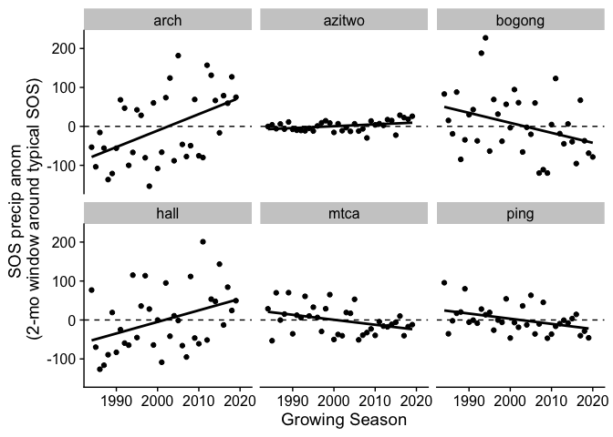
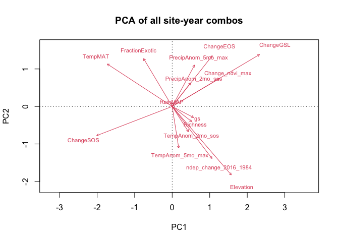
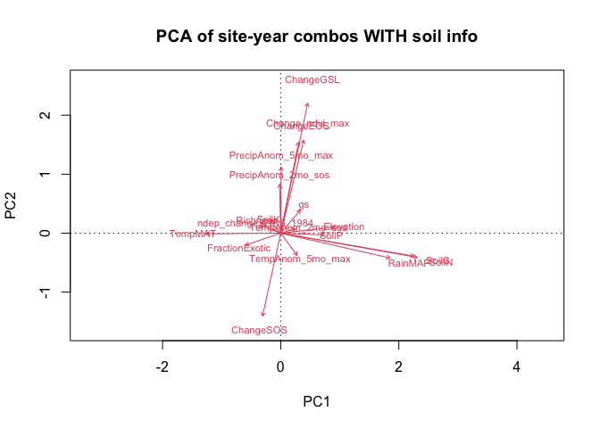

NutNet Phenology with NDVI
================
Ellen Esch
28 January 2021

-   [Overview](#overview)
-   [Process weather & climate data](#process-weather-climate-data)
-   [Process site-specific info (from
    dropbox)](#process-site-specific-info-from-dropbox)
    -   [Nitrogen deposition data](#nitrogen-deposition-data)
    -   [Biomass, richness, etc.](#biomass-richness-etc.)
-   [Process the Landsat NDVI data](#process-the-landsat-ndvi-data)
    -   [Collect raw data from Google Earth
        Engine](#collect-raw-data-from-google-earth-engine)
    -   [Identify phenological dates](#identify-phenological-dates)
-   [Determine sites to use in
    analysis](#determine-sites-to-use-in-analysis)
-   [Merge climate data with phenology data, process temporal
    trends](#merge-climate-data-with-phenology-data-process-temporal-trends)
-   [Make final dataframes](#make-final-dataframes)
-   [Start analysis](#start-analysis)
    -   [Overview](#overview-1)
    -   [NDVI is an okay predictor of
        productivity](#ndvi-is-an-okay-predictor-of-productivity)
    -   [Some of the world is greening](#some-of-the-world-is-greening)
    -   [PCAs](#pcas)
    -   [NutNet 2020 discussions](#nutnet-2020-discussions)

# Overview

This document walks through the steps necessary to process and aggregate
long-term phenological and productivity trends across many NutNet sites.
This analysis leverages satellite-derived data, and those raw data are
not collected within this script (but find directions relevant to that
Google Earth Engine step here).

While most files are stored on GitHub, you will need to set set the
location to your dropbox folder which contains the raw NutNet data.

In all cases, intermediate (processed) files *are* stored on GitHub.
However, you may change the suite of statements equal to `TRUE` if you
wish to process any raw data again.

``` r
dropboxdir <- "/Users/ellen/Dropbox/NutNet data"

process_raw_climate <- FALSE # TRUE
localdir <- "/Users/ellen/Desktop/Ellen/Guelph/Project_Andrew phenology/pheno_localdata" #set this if processing_raw_climate == TRUE

process_raw_ndvi <- FALSE #TRUE

merge_climate_ndvi <- FALSE #TRUE
```

# Process weather & climate data

-   Download monthly [precipitation
    data](http://data.ceda.ac.uk/badc/cru/data/cru_ts/cru_ts_4.04/data/pre)
    onto your local machine (large files). You will have to either
    create an account or log in. Download 4 time periods (1981-1990,
    1991-2000, 2001-2010, 2011-2019; you want the files with the ‘nc’ in
    the name)

<!-- -->

    ## [1] "not processing raw CLIMATE data"

-   Repeat with monthly [temperature
    data](http://data.ceda.ac.uk/badc/cru/data/cru_ts/cru_ts_4.04/data/tmp).

<!-- -->

    ## [1] "not processing raw CLIMATE data"

-   Write a data frame with merged monthly temperature and precipitation
    data

<!-- -->

    ## [1] "not processing raw CLIMATE data"

-   **See next point**, but in general…. Download [30 year averages from
    WorldClim](https://www.worldclim.org/data/worldclim21.html) onto
    your local machine. Download the most detailed spatial level (30
    seconds) for:

-   average temperature (tavg\_30s)

-   precipitation (preci\_30s)

<!-- -->

    ## [1] "not processing raw CLIMATE data"

-   Look at the monthly deviations from the long term average.

This first plot illustrates a problem (fortunately with an easy
solution). At Cowichan notice there are no consistent longitudinal
trends in precipitation, but it is obvious that WorldClim (long term
average) and CEDA (monthly) data don’t always necessarily align
(expected because they have different methods, resolutions, etc.). This
suggests that CEDA should be used to calculate long-term averages
(1981-2019, 39 years) as well as anomalies.

<!-- -->

Indeed, using CEDA data to calculate averages as well as anomalies
proves to be a much more logical metric. Cowichan data seems *much* more
logical now.

<!-- -->

# Process site-specific info (from dropbox)

## Nitrogen deposition data

**NOTE** Previously N deposition was extracted from “F. Dentener, Global
maps of atmospheric nitrogen deposition, 1860, 1993, and 2050. ORNL DAAC
(2006)”. However, two things have happened: a) r spatial has a bug (it’s
known, and I guess they’re working on it so this could be fixed), b) a
07 Dec 2020 update added n deposition data to the NutNet Dropbox. Thus,
we are proceeding with the file in the dropbox….

Additionally, note that the new data in the NutNet dropbox allows us to
better look at *change* in N deposition over time. Since we are
evaluating phenological/NDVI change over time as well, this seems like a
logical addition.

## Biomass, richness, etc.

Extract important site-specific information the NutNet master data files
(species richness, elevation, management, soil nutrients, etc).

Additionally, process observational year data on species evenness.

To connect on-the-ground biomass measurements with NDVI, also extract
the average biomass (ANPP) for all control plots for all years
available.

<!-- -->

# Process the Landsat NDVI data

For this analyses, I have focused on Landsat Satellites 4, 5, 7, and 8.
All have a resolution of 30 m. Prior Landsats were more coarse (LS 1 & 2
= 80 m resolution, LS 3 = 40 m resolution). In [google earth
engine](https://code.earthengine.google.com/), I have processed the top
of atmosphere values, filtered data by band quality, and included both
[tier 1 and tier 2
data](https://www.usgs.gov/core-science-systems/nli/landsat/landsat-collection-1?qt-science_support_page_related_con=1#qt-science_support_page_related_con).
From tier 1 data, readings which indicated clear conditions or snow
cover at time of imagery were kept. From tier 2 data, NDVI was only used
when the band quality indicated snow cover. Tier 2 data were used as a
supplement, because the snow covered satellite images were often not
included tier 1 data. It is important to have sufficient Landsat data
coverage during snow-covered periods (if applicable!) so that accurate
“troughs” can be identified.

As an FYI, Landsat coverage improved greatly with satellites 7 and 8. As
such, some sites have very sparse coverage prior to 1999. However, the
scan-line corrector on Landsat 7 failed on June 2003, meaning that some
sites again had only spotty coverage until Landsat 8’s launch in 2003.

At each NutNet site, I picked an adjacent area to the experimental plot
locations. There, I took a 30 m buffer radius (a couple sites are
different - see GEE code) around that point to be our “site.” Sometimes
this meant that multiple paths/rows of Landsat were included, which is
fine. Sometimes it might mean that the NutNet site is not accurately
reflected in our data (if for example a grassland site occurs amidst a
bunch of trees…those trees might get included by using this method).
Essentially, if the NDVI data looks really bad for a specific site, the
accuracy and relevance of the location I chose is probably the first
thing to check - how accurately does our designated “region of interest”
reflect the landscape?

## Collect raw data from Google Earth Engine

In goggle earth engine, the following was run. Apologies that it’s long,
messy, and that I’m not very good at creating loops within loops in
JavaScript! There are some button options that pop up in GEE prompting
the various extracted data to be saved. And that each site needs to get
individually commented out and run. It’s not pretty - but it does work
well!!!

**NOTE** the lat/longs were “found” by using the
`/Dropbox/NutNet data/sites-02-August-2019.csv`. NOT all of the sites
have data in the `comb-by-plot-clim-soil-diversity-07-December-2020.csv`
file (and so will subsequently be excluded).

`GEE code not shown here due to length, but feel free to look at it in the markdown file`

## Identify phenological dates

There are seemingly infinite ways to process NDVI to pick out
phenological dates. Quickly, we fitted cubic splines to each growing
season at each site. We found that a single spline fit to each site
(encompassing all growing years) was too sensitive to years with large
spans of time without NDVI values. Then, we picked out the maximum NDVI
from the fitted spline in each growing season. And the first date where
NDVI &gt;= 50 of the average range of NDVI (plus the avg. min) (as a
green-up threshold). Originally I had used a fancy combination of
derivatives (Buitenwerf et al), but they turned out to be very sensitive
to missing values (problematic in snow-covered regions).

Behind the scenes, some fancy (and not-so-fancy) data processing
happened: 1) dates were treated as radians to accommodate southern
hemisphere and Mediterranean sites with potential phenological dates
spanning across years within the same growing season (for instance, a
site with green-up in Dec 2018, NDVI max in March 2019, and brown down
in May 2019; this is all classified as occurring during the 2019 growing
season.) 2) At certain sites there are periods of the year where NDVI
data are not available, either because of persistent seasonal clouds,
algorithm confusion between clouds and snow (aka water reflectance), or
poor radiometric calibration on the Landsat satellites. Conversely,
there may often be time periods in which the 10-day average Landsat
coverage of a site is way more frequent (for example, periods when both
Landsat 7 and 8 orbit, etc).  
3) NDVI values which were &lt; 0 were reassigned a value of 0. This
helped the fitted splines behave much better. 4) Regarding weighting
points within the splines, each growing season’s maximum NDVI value was
weighted at 1, and all other values at 0.5 in order to most accurately
capture the peak.

Also, some sites are strange - need to contact PIs eventually. \*
lake\_us, lakta\_se, marc\_ar, mitch\_au, tyso\_us, valm\_ch, xilin\_cn,
bldr\_us all needed larger radius buffers

Going through the steps in more detail:

-   Create functions to convert linear (Julian) calendar days into
    radian (circular) data. (because southern hemisphere/Mediterranean
    sites which green up on, say Julian day 365 on average…but if one
    year greens up on Julian day 1, this is a 1 day difference NOT a
    -365 day difference)

-   Filter the Landsat data to include only pixels identified as being
    “clear” or “snow” covered. **NOTE** This should probably be double
    checked, I started off very conservatively when deciding to include
    tier 2 data. Documentation could have been much more through, so it
    would be good to see if there are some additional data which should
    be included/excluded. Also we set the minimum NDVI to 0 to assist in
    the spline fitting.

<!-- -->

    ## [1] "not processing raw NDVI data"

-   Identify the average trough (lowest NDVI) date. From that, a
    “growing season” or “phenological year” is subsequently identified
    as the 365 days following the “trough date” plus an 90 day buffer on
    either end. So a total of 90 + 365 + 90 days. I know this is not
    totally right since leap years are confusing. Within these
    phenological years we create a long data set of all NDVI readings
    (readings must be duplicated if they fall in the “shoulder season”).

<!-- -->

    ## [1] "not processing raw NDVI data"

-   Then we fit cubic splines to each site-year combo. These splines are
    weighted (max NDVI in each year = weight 1; all others = weight
    0.5), and have a smoothing parameter of 0.5 (spar = 0.5). The
    green-up criteria assigned is basically the 50% of the average range
    of NDVI at each site ((avg max - avg min \* 50) + avg min) plus a
    little buffer. This means that green-up threshold is constant at all
    years within a site (it’s a huge advantage over using derivative
    -based inflection points when the number of ndvi readings can be
    highly variable between years. also it’s a bit nonsense to say that,
    hypothetically, green-up has been getting earlier over time and yet
    the NDVI at green-up date is not consistent.).

    -   Each site-year combo must have at least 10 NDVI readings
        (`measurementscutoff`) for us to determine phenological dates.

    -   Extra Green-up criteria:

        -   The first derivative needed to indicate that the NDVI was
            increasing (first derivative &gt; 0)
        -   The NDVI needed to be above 0 (a low threshold, very easy!)
        -   Green-up date was the FIRST DAY where NDVI was above the
            green-up threshold + 0.02 NDVI (I forget what all the
            problems were if it was simply just the cutoff, but they
            were there)
        -   The green-up date must occur within the “main” growing
            season (not within the shoulder seasons).

    -   Maximum:

        -   Must occur after green-up date but within the “main” growing
            season (no shoulder seasons)
        -   If there was no green-up date (due to sparse data, no rain,
            fire, whatever), we still forced a maximum NDVI date

    -   Senescence:

        -   The first derivative must be negative (indicating declining
            function/NDVI)
        -   Must occur after the maximum NDVI date
        -   NDVI must be less than the green-threshold (&lt; Max50) but
            ABOVE the threshold - 0.05 (NDVI &gt; (Max50 - .05))). Had
            to do this so that it wouldn’t pick a senescence date that
            had a crazy low NDVI in the event of sparse data.

Of course, all the dates were “redialed” as departure from the average
start/end at each site to get change over time

    ## [1] "not processing raw NDVI data"

-   For plotting purposes, the individual year-site combo splines were
    run again, and all the fitted NDVI values extracted. Here is a
    figure showing all processed NDVI data (the black points are the
    actual NDVI readings, and the black line is the fitted NDVI spline
    from which phenological dates were extracted).

<!-- -->

    ## [1] "not processing raw NDVI data"

<!-- -->

# Determine sites to use in analysis

Given that we are looking at long-term trends, it doesn’t make much
sense to include sites which only have a minimal amount of years were we
could extract meaninfulphenological dates. Reasons that sites might not
have enough years include: satellites had poor coverage of location (esp
true in earlier landsats), too much cloud cover (and thus couldn’t fit a
nice trend/too few images during growing season), site never
“greened-up” threshold during a given year (important esp for
Mediterranean sites, and probably other reasons.

Here is the list of sites which made the cut. Of course, as PIs
confirm/add/remove site lat/long, this list will change.

    ##  [1] "abisko"    "amcamp"    "arch"      "azitwo"    "badlau"   
    ##  [6] "bari"      "barta"     "bayr"      "bldr"      "bnbt"     
    ## [11] "bnch"      "bogong"    "bttr"      "bunya"     "burrawan" 
    ## [16] "burren"    "bynb"      "cbgb"      "cdcr"      "cdpt"     
    ## [21] "chilcas"   "comp"      "cowi"      "derr"      "doane"    
    ## [26] "elkh"      "elliot"    "elva"      "ethamc"    "frue"     
    ## [31] "gilb"      "glac"      "glcr"      "hall"      "hart"     
    ## [36] "hast"      "hero"      "hopl"      "jasp"      "jorn"     
    ## [41] "kark"      "kbs"       "kibber"    "kidman"    "kilp"     
    ## [46] "kiny"      "kirik"     "koffler"   "konz"      "lagoas"   
    ## [51] "lake"      "lancaster" "lead"      "look"      "lubb"     
    ## [56] "marc"      "mcdan"     "mcla"      "mitch"     "msla"     
    ## [61] "msum"      "mtca"      "nilla"     "ping"      "pinj"     
    ## [66] "potrok"    "sage"      "saline"    "sedg"      "sereng"   
    ## [71] "sevi"      "sgs"       "shps"      "sier"      "smith"    
    ## [76] "spv"       "summ"      "temple"    "ucsc"      "ukul"     
    ## [81] "unc"       "uwo"       "valm"      "vargrass"  "vass"     
    ## [86] "yarra"

# Merge climate data with phenology data, process temporal trends

-   The goal is to recognize that some growing seasons see bigger
    temperature and precipitation anomalies, does that influence site
    phenology/productivity? To look at the temp/precip anomolies in each
    growing season:
    -   We can look weather windows BEFORE/during the typical green-up
        month (here looking at the 2 month window before the typical
        green-up date)
    -   And also do weather windows around the typical date of NDVI max
        (here looking at a 5 month window around the typical maximum
        ndvi date (basically the month of max ndvi + the 2 months before
        and after from that date; this is essentially a growing season)

This plot simply shows sites which have seen a significant trend in
temperatures and precipitaiton over time within a 2 month window
preceding the site-specific typical green-up date.

    ## [1] "Not merging weather and ndvi"

<!-- --><!-- -->

-   Similarly, we want to see if sites have seen significant changes in
    phenological dates over time.

<!-- -->

    ## [1] "Not merging weather and ndvi"

<table>
<thead>
<tr>
<th style="text-align:left;">
Response variable
</th>
<th style="text-align:right;">
Sites w/ ns temporal trend
</th>
<th style="text-align:right;">
Sites w/ sig temporal trend
</th>
<th style="text-align:right;">
Fraction sig. sites
</th>
</tr>
</thead>
<tbody>
<tr>
<td style="text-align:left;">
eos
</td>
<td style="text-align:right;">
75
</td>
<td style="text-align:right;">
11
</td>
<td style="text-align:right;">
0.07
</td>
</tr>
<tr>
<td style="text-align:left;">
gsl
</td>
<td style="text-align:right;">
67
</td>
<td style="text-align:right;">
19
</td>
<td style="text-align:right;">
0.14
</td>
</tr>
<tr>
<td style="text-align:left;">
maxndvi
</td>
<td style="text-align:right;">
40
</td>
<td style="text-align:right;">
46
</td>
<td style="text-align:right;">
0.57
</td>
</tr>
<tr>
<td style="text-align:left;">
sos
</td>
<td style="text-align:right;">
73
</td>
<td style="text-align:right;">
13
</td>
<td style="text-align:right;">
0.09
</td>
</tr>
</tbody>
</table>

# Make final dataframes

`df_annual` contains a row for every growing season at each site. It
includes information like climate and phenological anomalies, annual
biomass, dates, etc. `df_site` contains a single row for each site. It
includes information like N deposition, soil nutrients, species
richness.

Please see excel sheet for metadata/column descriptions

These two data frames can be combined into a `df_merge`.

# Start analysis

## Overview

Sites included in this analyses occur across a wide range of locations
(elevation, lat/long), soil characteristics (%C, ppmP, %N), climatic
variables (MAP, MAT), and plant species richness.

<!-- -->

Sites also occur across continents and across different ecosystems
(habitats). (Note, mcdan and vargrass are the sites that don’t have
habitat information in the latest dropbox file)

<table>
<thead>
<tr>
<th style="text-align:left;">
continent
</th>
<th style="text-align:right;">
N sites
</th>
</tr>
</thead>
<tbody>
<tr>
<td style="text-align:left;">
North America
</td>
<td style="text-align:right;">
45
</td>
</tr>
<tr>
<td style="text-align:left;">
Europe
</td>
<td style="text-align:right;">
15
</td>
</tr>
<tr>
<td style="text-align:left;">
Australia
</td>
<td style="text-align:right;">
13
</td>
</tr>
<tr>
<td style="text-align:left;">
South America
</td>
<td style="text-align:right;">
6
</td>
</tr>
<tr>
<td style="text-align:left;">
Africa
</td>
<td style="text-align:right;">
4
</td>
</tr>
<tr>
<td style="text-align:left;">
Asia
</td>
<td style="text-align:right;">
3
</td>
</tr>
</tbody>
</table>
<table>
<thead>
<tr>
<th style="text-align:left;">
habitat
</th>
<th style="text-align:right;">
N sites
</th>
</tr>
</thead>
<tbody>
<tr>
<td style="text-align:left;">
mesic grassland
</td>
<td style="text-align:right;">
12
</td>
</tr>
<tr>
<td style="text-align:left;">
tallgrass prairie
</td>
<td style="text-align:right;">
10
</td>
</tr>
<tr>
<td style="text-align:left;">
semiarid grassland
</td>
<td style="text-align:right;">
9
</td>
</tr>
<tr>
<td style="text-align:left;">
annual grassland
</td>
<td style="text-align:right;">
8
</td>
</tr>
<tr>
<td style="text-align:left;">
old field
</td>
<td style="text-align:right;">
7
</td>
</tr>
<tr>
<td style="text-align:left;">
alpine grassland
</td>
<td style="text-align:right;">
5
</td>
</tr>
<tr>
<td style="text-align:left;">
montane grassland
</td>
<td style="text-align:right;">
5
</td>
</tr>
<tr>
<td style="text-align:left;">
tundra grassland
</td>
<td style="text-align:right;">
4
</td>
</tr>
<tr>
<td style="text-align:left;">
grassland
</td>
<td style="text-align:right;">
3
</td>
</tr>
<tr>
<td style="text-align:left;">
mixedgrass prairie
</td>
<td style="text-align:right;">
3
</td>
</tr>
<tr>
<td style="text-align:left;">
pasture
</td>
<td style="text-align:right;">
3
</td>
</tr>
<tr>
<td style="text-align:left;">
savanna
</td>
<td style="text-align:right;">
3
</td>
</tr>
<tr>
<td style="text-align:left;">
shortgrass prairie
</td>
<td style="text-align:right;">
3
</td>
</tr>
<tr>
<td style="text-align:left;">
calcareous grassland
</td>
<td style="text-align:right;">
2
</td>
</tr>
<tr>
<td style="text-align:left;">
desert grassland
</td>
<td style="text-align:right;">
2
</td>
</tr>
<tr>
<td style="text-align:left;">
shrub steppe
</td>
<td style="text-align:right;">
2
</td>
</tr>
<tr>
<td style="text-align:left;">
NA
</td>
<td style="text-align:right;">
2
</td>
</tr>
<tr>
<td style="text-align:left;">
cerrado
</td>
<td style="text-align:right;">
1
</td>
</tr>
<tr>
<td style="text-align:left;">
grassland steppe
</td>
<td style="text-align:right;">
1
</td>
</tr>
<tr>
<td style="text-align:left;">
salt marsh
</td>
<td style="text-align:right;">
1
</td>
</tr>
</tbody>
</table>

Here is a map of the sites:

<!-- -->

## NDVI is an okay predictor of productivity

Of course, some arguments get made that NDVI is less subject to
bias/error than on-the-ground data collection. But the more logical
reason for any mismatch here is that NDVI was measured *adjacent* to the
main NutNet plots (because we didn’t want to capture the influence of
nutrients during the years when nutrient addition started).

Logistically, I think it makes most sense to include sites that have
&gt;= 3 years of biomass+ndvi data in this trend. Because it’s not
reasonable to think that a tallgrass prairie is going to have the same
ndvi-biomass relationship as an alpine meadow and we want to capture the
site-trend.

Statistically, AIC scores were compared between 4 different models
relating maximum NDVI to ANPP. Because NDVI tends to saturate at high
levels of biomass production, sometimes (but not always!) ANPP is
related to the log of the maximum NDVI. Sometimes (but not always!) the
relationships between NDVI and ANPP are forced through the origin (0,0)
as zero NDVI value should indicate no biomass. All of these options were
compared with the following models:

1.  intercept through (0,0); ANPP \~ log(maxNDVI)
2.  intercept through (0,0); ANPP \~ maxNDVI
3.  no fixed intercept; ANPP \~ log(maxNDVI)
4.  no fixed intercept; ANPP \~ maxNDVI

Model 4 had the lowest AIC score, and yields the following relationship
with a r-squared value of `0.2691894`:

ANPP = `-119.3883112` + maxNDVI \* `785.0950005`

<!-- -->

Here are some other analyses you might want to do….

## Some of the world is greening

First, show that there has been a directional, temporal shift towards
“greening” and earlier springs since \~1980.

``` r
Anova(lmer(Change_ndvi_max ~ 
             site * gs + 
             (1|gs), 
           data = filter(df_annual, !is.na(Change_ndvi_max))))
```

    ## Analysis of Deviance Table (Type II Wald chisquare tests)
    ## 
    ## Response: Change_ndvi_max
    ##           Chisq  Df Pr(>Chisq)    
    ## site    292.261 107  < 2.2e-16 ***
    ## gs       69.865   1  < 2.2e-16 ***
    ## site:gs 309.840 107  < 2.2e-16 ***
    ## ---
    ## Signif. codes:  0 '***' 0.001 '**' 0.01 '*' 0.05 '.' 0.1 ' ' 1

<!-- -->

## PCAs

Could be a useful part of the fishing expedition…

<!-- -->

    ## [1] 84

    ## [1] 53

<!-- -->

    ## [1] 53

In looking at sites which have *most* site-level data, there are `84`
sites.

<!-- -->

## NutNet 2020 discussions

Running into issues with singularities, this never got resolved…..

Basically the goal is to go on a fishing expidition…

    ## Linear mixed model fit by REML ['lmerMod']
    ## Formula: ChangeSOS ~ gs + (gs | site)
    ##    Data: filter(df_annual, !is.na(ChangeSOS))
    ## 
    ## REML criterion at convergence: 25267.4
    ## 
    ## Scaled residuals: 
    ##     Min      1Q  Median      3Q     Max 
    ## -4.9234 -0.4525 -0.0112  0.4327  5.8647 
    ## 
    ## Random effects:
    ##  Groups   Name        Variance  Std.Dev. Corr 
    ##  site     (Intercept) 1.005e+03 31.70198      
    ##           gs          2.628e-04  0.01621 -1.00
    ##  Residual             1.009e+03 31.76882      
    ## Number of obs: 2590, groups:  site, 108
    ## 
    ## Fixed effects:
    ##              Estimate Std. Error t value
    ## (Intercept) 620.43984  131.85116   4.706
    ## gs           -0.31030    0.06581  -4.715
    ## 
    ## Correlation of Fixed Effects:
    ##    (Intr)
    ## gs -1.000
    ## convergence code: 0
    ## boundary (singular) fit: see ?isSingular

    ## Analysis of Deviance Table (Type II Wald chisquare tests)
    ## 
    ## Response: PhenoTrendXyr_sos_slope
    ##                         Chisq Df Pr(>Chisq)    
    ## abs(latitude)         34.1558  1  5.087e-09 ***
    ## Elevation             11.6991  1  0.0006253 ***
    ## RainMAP                2.2243  1  0.1358508    
    ## TempMAT                7.7765  1  0.0052931 ** 
    ## ndep_change_2016_1984 24.5892  1  7.095e-07 ***
    ## Richness               3.1151  1  0.0775714 .  
    ## FractionExotic         3.3911  1  0.0655488 .  
    ## ---
    ## Signif. codes:  0 '***' 0.001 '**' 0.01 '*' 0.05 '.' 0.1 ' ' 1
